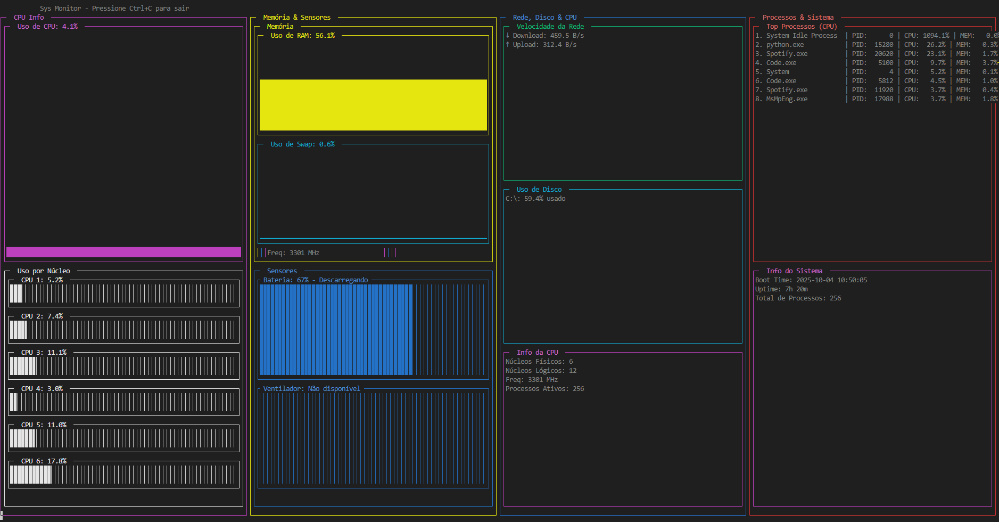

# 📊 Sys Monitor - Monitor de Sistema em Tempo Real


> Monitor de sistema completo em Python com interface visual no terminal. Desenvolvido como parte do **Desafio I** de Sistemas Operacionais.

## 📸 Interface



## ✨ Características

### 📋 Requisitos do Desafio I (100% Completo)

| Item | Recurso | Status |
|------|---------|--------|
| 1️⃣ | Quantidade de núcleos / CPU | ✅ |
| 2️⃣ | Quantidade de memória usada / livre | ✅ |
| 3️⃣ | Lista de processos | ✅ |
| 4️⃣ | Detalhamento de processo por ID | ✅ |
| 5️⃣ | Nível de bateria | ✅ |

### � Recursos Extras

- 📊 **Gráficos visuais em tempo real** (CPU, memória, bateria)
- 🌐 **Velocidade de rede** (download/upload)
- 💾 **Monitoramento de disco** (múltiplas partições)
- 🌡️ **Sensores de hardware** (ventiladores - Linux)
- ⏱️ **Uptime e Boot Time**
- 🎨 **Interface colorida e responsiva**

## 🚀 Início Rápido

```bash
# 1. Clone o repositório
git clone https://github.com/danielduartt/sys-monitor.git
cd sys-monitor

# 2. Instale as dependências
pip install -r requirements.txt

# 3. Execute o monitor
python main.py

# 4. Para sair, pressione Ctrl+C
```

## 🗂️ Estrutura

```
sys-monitor/
├── main.py                      # 🚀 Executável principal
├── requirements.txt             # 📦 Dependências
├── jobs/                        # 📊 Módulos de coleta
│   ├── cpu.py                   # CPU e núcleos
│   ├── memory.py & swap.py      # Memória
│   ├── processes.py             # Processos
│   ├── system.py                # Sistema
│   ├── network.py & disk.py     # Rede e disco
│   └── sensores.py              # Bateria e sensores
├── ui/                          # 🎨 Interface
│   └── display.py               # Dashboard
└── docs/                        # 📚 Documentação
```

## 🎯 Exemplos de Uso

### Dashboard Completo
```bash
python main.py
```

### Testar Módulos
```bash
python test_modules.py
```

## 💻 Tecnologias

- **Python 3.8+**
- **psutil** - Coleta de dados do sistema
- **py-dashing** - Interface visual no terminal
- **blessed** - Manipulação avançada de terminal

## 🌐 Compatibilidade

| Sistema | Status | Observações |
|---------|--------|-------------|
| 🪟 Windows | ✅ Completo | Ventiladores não disponíveis |
| 🐧 Linux | ✅ Completo | Todas as features |
| 🍎 macOS | ✅ Completo | Ventiladores limitados |

## 🔮 Próximas Versões

### 🎨 Interface Web (Planejado)
- **Dash** ou **Streamlit** para interface web
- Gráficos interativos e histórico
- Dashboard responsivo
- Múltiplos temas
- Exportação de relatórios

### 📊 Recursos Futuros
- Alertas e notificações
- Histórico de uso
- Comparação temporal
- Gráficos avançados
- Monitoramento remoto

## 📈 Status do Projeto

**Versão Atual:** 1.0.0 - Terminal Interface  
**Status:** ✅ 100% Completo (Desafio I)  
**Próxima Versão:** 2.0.0 - Web Interface (Dash/Streamlit)

## 📝 Licença

Este projeto está sob a licença MIT. Veja o arquivo [LICENSE](LICENSE) para mais detalhes.

## 👨‍� Autor

**Duarte**  
GitHub: [@danielduartt](https://github.com/danielduartt)

## 🎓 Agradecimentos

Projeto desenvolvido como parte do **Desafio I** da disciplina de Sistemas Operacionais.

---

## 📌 Links Rápidos

- 📚 [Guia de Uso Detalhado](./docs/GUIA_USO.md)
- 🔮 [Roadmap - Próximas Versões](./docs/ROADMAP.md)

---